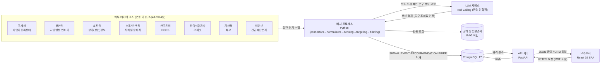
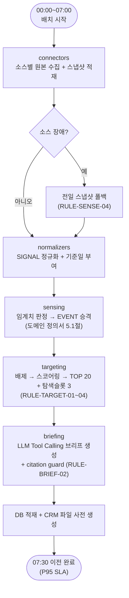
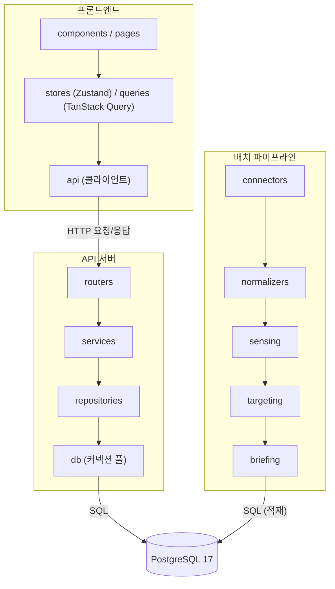

# BranchSense 기술 아키텍처 다이어그램

- **버전**: v1.0.1
- **작성일**: 2026-08-26 (최종 수정: 2026-09-08)

---

## 변경 이력

| 버전 | 날짜 | 내용 |
|---|---|---|
| v1.0.0 | 2026-08-26 | 초안 작성 |
| v1.0.1 | 2026-09-08 | 문서 정합성 점검 결과 반영: 참조 문서 버전 표기를 최신본에 맞게 정정 (내용 변경 없음) |

---

## 0. 문서 목적 및 전제

본 문서는 `2-prd.md`(v1.1.2) 5~6장의 기술 스택·비기능 요건과 `4-project-principle.md`(v1.1.2) 2장·6장의 레이어 구조·디렉토리 구조를 시각화한다. 마이크로서비스, 메시지 큐, API 게이트웨이, 배치 오케스트레이션 프레임워크는 이 프로젝트 범위에 없으므로 다이어그램에 포함하지 않는다(PRIN-02).

LLM 추론 환경(외부 API 사용 가능 여부)은 `2-prd.md` 10장 미해결 이슈 2번으로 아직 확정되지 않았다. 아래 다이어그램은 외부 LLM API를 가정한 구성이며, 사내 전용 엔드포인트로 확정될 경우 "LLM 서비스" 박스만 내부 네트워크로 교체되고 나머지 구조는 동일하다.

---

## 1. 전체 시스템 구성도

배치 프로세스가 매일 07:30 SLA에 맞춰 8개 공공데이터 소스를 수집·정규화·판정·채점하고, LLM Tool Calling으로 브리프를 생성해 PostgreSQL에 적재한다. 브라우저(React SPA)는 FastAPI API 서버를 통해 이 결과를 조회하고, 태깅·임계치 변경·캠페인 승인 요청을 API 서버에 보낸다. API 서버와 배치 프로세스는 동일한 DB를 공유하되 별도 프로세스로 실행된다(`4-project-principle.md` 0장).

---

## 2. 배치 파이프라인 흐름도

매일 07:30 SLA(`2-prd.md` 6장)를 만족해야 하는 일간 파이프라인의 단계별 흐름이다. 각 단계는 `4-project-principle.md` 2장의 레이어 순서를 그대로 따른다.

> 학습(`learning`, 주 1회)과 캠페인(`campaign`, 이벤트 트리거)은 이 일간 SLA 대상이 아니며 별도 진입점(`run_weekly.py`, 트리거 기반 실행)으로 분리되어 있다(`4-project-principle.md` 6장).

---

## 3. 레이어 구조도

`4-project-principle.md` 2장에 정의된 배치·API·프론트엔드 레이어와 의존 방향(상위 → 하위, 단방향)을 그대로 표현한다.

---

## 4. 참고 문서

- `2-prd.md` (v1.1.2): 5장 기술 스택, 6장 비기능 요건(성능, SLA, 재현성), 10장 미해결 이슈(LLM 추론 환경)
- `4-project-principle.md` (v1.1.2): 2장 레이어 원칙, 6장 디렉토리 구조
