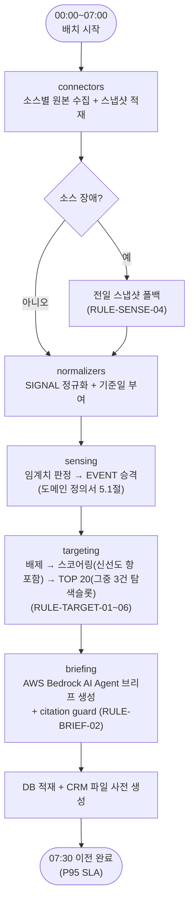
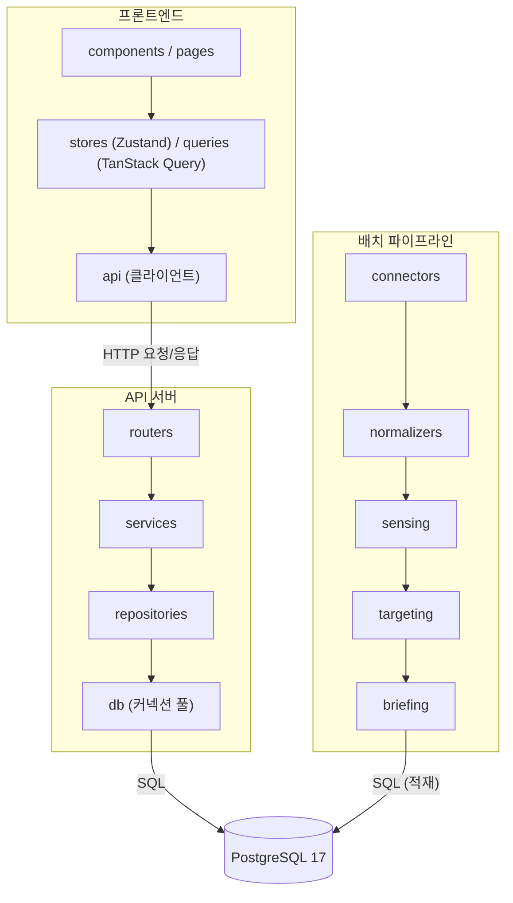

# C-MAKER 기술 아키텍처 다이어그램

- **버전**: v1.3.1
- **작성일**: 2026-08-26 (최종 수정: 2026-09-08)

---

## 변경 이력

| 버전 | 날짜 | 내용 |
|---|---|---|
| v1.0.0 | 2026-08-26 | 초안 작성 |
| v1.0.1 | 2026-09-08 | 문서 정합성 점검 결과 반영: 참조 문서 버전 표기를 최신본에 맞게 정정 (내용 변경 없음) |
| v1.1.0 | 2026-09-08 | `2-prd.md` v1.2.0의 AWS Bedrock 결정 반영: "LLM 서비스"/"RAG" 박스를 AWS Bedrock AI Agent / Knowledge Base로 교체하고, Agent가 Knowledge Base를 직접 조회하는 구조로 1·2장 다이어그램을 갱신 |
| v1.2.0 | 2026-09-08 | `report/CHANGE-REQUEST_v1.md` CHG-09 반영: §1에 지방행정 인허가 전수 → `population`(월 1회) → BUSINESS 적재 흐름 추가, §2에 `population` 진입점(`run_monthly.py`) 분리 서술 추가. 기존 불일치(부록 A) 해소: §2 `targeting` 박스의 "TOP 20 + 탐색슬롯 3" 표기를 "TOP 20(그중 3건 탐색슬롯)"으로 정정 |
| v1.3.0 | 2026-09-08 | 배치 지연/실패 대비 수동 재연동(REQ-17, UC-18) 반영: §1에 Browser→API→Batch 수동 재실행 요청/응답 흐름 추가, §2에 수동/예약 실행 구분이 BATCH_RUN 기록에만 존재함을 명시 |
| v1.3.1 | 2026-09-08 | 문서 정합성 점검 결과 반영: 참조 문서 버전 표기를 최신본에 맞게 정정 (내용 변경 없음) |

---

## 0. 문서 목적 및 전제

본 문서는 `2-prd.md`(v1.4.0) 5~6장의 기술 스택·비기능 요건과 `4-project-principle.md`(v1.5.0) 2장·6장의 레이어 구조·디렉토리 구조를 시각화한다. 마이크로서비스, 메시지 큐, API 게이트웨이, 배치 오케스트레이션 프레임워크는 이 프로젝트 범위에 없으므로 다이어그램에 포함하지 않는다(PRIN-02).

LLM 추론 환경은 `2-prd.md` v1.2.0(10장 미해결 이슈 2번)에서 AWS Bedrock(AI Agent + Knowledge Base)으로 확정되었다. 아래 다이어그램은 이 결정을 반영한 구성이다. 리전·VPC PrivateLink 등 데이터 반출 경로의 보안팀 최종 승인은 별도 진행 중이며(`2-prd.md` 6장), 승인 결과에 따라 "AWS Bedrock" 박스가 VPC 엔드포인트 경유 구성으로 바뀔 수 있으나 나머지 구조는 동일하다.

---

## 1. 전체 시스템 구성도

배치 프로세스가 매일 07:30 SLA에 맞춰 8개 공공데이터 소스를 수집·정규화·판정·채점하고, AWS Bedrock AI Agent를 호출해 브리프를 생성해 PostgreSQL에 적재한다. 브라우저(React SPA)는 FastAPI API 서버를 통해 이 결과를 조회하고, 태깅·임계치 변경·캠페인 승인 요청을 API 서버에 보낸다. API 서버와 배치 프로세스는 동일한 DB를 공유하되 별도 프로세스로 실행된다(`4-project-principle.md` 0장).

```mermaid
flowchart LR
    subgraph External["외부 데이터 소스 (연동 가능, 2-prd.md 4장)"]
        direction TB
        NTS["국세청<br/>사업자등록상태"]
        Local["행안부<br/>지방행정 인허가"]
        Sbiz["소진공<br/>상가(상권)정보"]
        Subway["서울/부산 등<br/>지하철 승하차"]
        Ecos["한국은행<br/>ECOS"]
        Opinet["한국석유공사<br/>오피넷"]
        Kma["기상청<br/>특보"]
        Disaster["행안부<br/>긴급재난문자"]
    end

    PermitFull["지방행정 인허가 전수<br/>(data.go.kr, 월 1회)"]
    Population["population<br/>business_loader"]
    Batch["배치 프로세스<br/>Python (connectors→normalizers→sensing→targeting→briefing)"]
    Bedrock["AWS Bedrock<br/>AI Agent"]
    KB[("AWS Bedrock<br/>Knowledge Base<br/>(공개 상품설명서)")]
    DB[("PostgreSQL 17")]
    API["API 서버<br/>FastAPI"]
    Browser["브라우저<br/>React 19 SPA"]

    External -- "일간·분기 수집" --> Batch
    PermitFull -- "모집단 적재 (월 1회, REQ-16)" --> Population
    Population -- "BUSINESS 적재 (WGS84 변환, VAL-11)" --> DB
    Batch -- "브리프·캠페인 문구 생성 요청" --> Bedrock
    Bedrock -- "지식베이스 조회 (인용 문단)" --> KB
    KB -- "인용 문단 응답" --> Bedrock
    Bedrock -- "생성 결과 (Action Group·KB 조회값 인용)" --> Batch
    Batch -- "SIGNAL·EVENT·RECOMMENDATION·BRIEF 적재" --> DB
    API -- "SQL" --> DB
    DB -- "쿼리 결과" --> API
    Browser -- "HTTPS 요청 (JWT 포함)" --> API
    API -- "JSON 응답 / CRM 파일" --> Browser
    Browser -- "수동 재연동 요청 (REQ-17, 지점장/본부(마케팅))" --> API
    API -- "run_daily.py 프로세스 기동" --> Batch
    API -- "BATCH_RUN 상태 폴링 응답" --> Browser
```

---

## 2. 배치 파이프라인 흐름도

매일 07:30 SLA(`2-prd.md` 6장)를 만족해야 하는 일간 파이프라인의 단계별 흐름이다. 각 단계는 `4-project-principle.md` 2장의 레이어 순서를 그대로 따른다.

> **모집단 적재(`population`, 월 1회)**, 학습(`learning`, 주 1회), 캠페인(`campaign`, 이벤트 트리거)은 이 일간 SLA 대상이 아니며 별도 진입점(**`run_monthly.py`**, `run_weekly.py`, 트리거 기반 실행)으로 분리되어 있다(`4-project-principle.md` 6장). **일간 파이프라인의 `targeting` 단계는 이미 적재된 BUSINESS를 읽기만 하며, 모집단 적재 실패가 07:30 SLA를 침해하지 않는다.**
>
> **수동 재실행(REQ-17)**: 위 `run_daily.py`(`Start → ... → Done`) 전체가 재실행 대상이다. API 서버(`batch.service.py`)가 `run_daily.py`를 별도 프로세스로 다시 기동하며, 배치 자체의 내부 흐름(장애 시 폴백, 순서 등)은 예약 실행과 동일하다 — 수동/예약 실행을 구분하는 로직은 배치 진입점이 아니라 API 서버의 `BATCH_RUN` 기록에만 존재한다.

---

## 3. 레이어 구조도

`4-project-principle.md` 2장에 정의된 배치·API·프론트엔드 레이어와 의존 방향(상위 → 하위, 단방향)을 그대로 표현한다.

---

## 4. 참고 문서

- `2-prd.md` (v1.4.0): 5장 기술 스택(AWS Bedrock 결정), 6장 비기능 요건(성능, SLA, 재현성), 10장 미해결 이슈
- `4-project-principle.md` (v1.5.0): 2장 레이어 원칙, 6장 디렉토리 구조
- `report/CHANGE-REQUEST_v1.md`: 모집단 적재 흐름 추가(CHG-09) 근거
