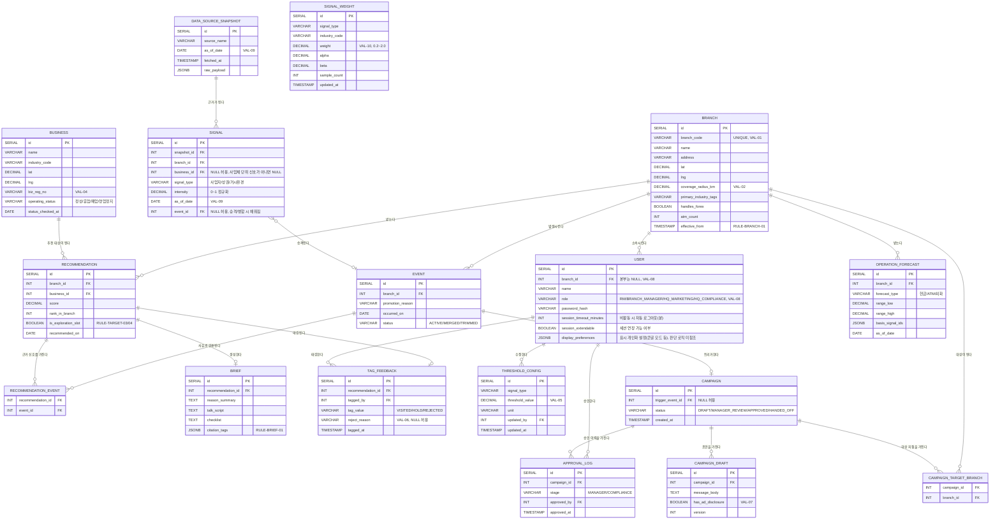

# BranchSense ERD (개체-관계 다이어그램)

- **버전**: v1.1.0
- **작성일**: 2026-08-26 (최종 수정: 2026-09-08)

---

## 변경 이력

| 버전 | 날짜 | 내용 |
|---|---|---|
| v1.0.0 | 2026-08-26 | 초안 작성 |
| v1.1.0 | 2026-09-08 | 문서 정합성 점검 결과 반영: (1) `1-domain-definition.md` v1.1.0에 추가된 USER 세션 정책·표시 개인화 설정을 `USER` 테이블 컬럼으로 반영(§0 전제 문구 조정 포함). (2) `USER.role`을 `본부(마케팅)`/`본부(준법)` 구분이 가능하도록 확장하고 CONST-03·CONST-11을 갱신 |

---

## 0. 문서 목적 및 전제

본 문서는 `1-domain-definition.md`(v1.1.1) 3장에 정의된 엔티티와 도메인 규칙을, `2-prd.md`(v1.1.1) 5장의 PostgreSQL 17 · ORM 미사용(직접 SQL) 제약과 `4-project-principle.md`(v1.1.1) 6장의 `database/schema.sql` 단일 파일 스키마 컨벤션에 맞춰 ERD로 표현한다. 세션 토큰·알림 이력처럼 도메인 정의서에 없는 개념의 전용 테이블은 추가하지 않되, 도메인 정의서가 특정 엔티티의 속성으로 명시한 값(예: USER의 세션 정책·표시 개인화 설정)은 해당 엔티티 테이블의 컬럼으로 반영한다.

Phase 2·3 전용 엔티티(`OPERATION_FORECAST`, `CAMPAIGN` 계열)도 함께 표기하되, 초기 스키마 마이그레이션에서 즉시 생성할지 여부는 `7-execution-plan.md`의 단계별 계획을 따른다.

---

## 1. ERD

> BUSINESS의 `operating_status`는 UC-03(사업자 상태 검증 배치)이 국세청 API 조회 결과로 갱신하는 값이며, 별도의 EVENT를 생성하지 않는다. 배제 필터(RULE-TARGET-01)는 이 컬럼을 직접 참조한다.

> RECOMMENDATION의 선정 사유(브리프 문장의 근거)는 `RECOMMENDATION_EVENT` 조인 테이블로 표현하며, 하나의 추천이 여러 EVENT를 근거로 가질 수 있다.

> SIGNAL_WEIGHT는 특정 지점에 속하지 않는 전역 학습 파라미터다. 스코어링(RULE-TARGET-02)은 매 배치마다 이 테이블을 조회해 사용하며, 갱신은 TAG_FEEDBACK을 신호×업종 단위로 집계하는 배치 로직(서비스 레이어)에서 수행한다 — 이 집계 관계는 ERD 문법으로 직접 표현하지 않는다(4장 CONST-08 참조).

---

## 2. 컬럼 설명 및 타입 근거

| 테이블 | 컬럼 | 타입 | 설명 |
|---|---|---|---|
| BRANCH | branch_code | VARCHAR(20) | VAL-01(유일, 영문 대문자+숫자) |
| BRANCH | coverage_radius_km | DECIMAL(3,1) | VAL-02(0.5~3.0) |
| BRANCH | effective_from | TIMESTAMP | RULE-BRANCH-01(변경 익일 배치부터 반영), 저장 시 다음 배치 실행 시각으로 자동 설정 |
| USER | role | VARCHAR(20) | 'RM', 'BRANCH_MANAGER', 'HQ_MARKETING', 'HQ_COMPLIANCE' 중 하나 (VAL-08). 'HQ_COMPLIANCE'만 `APPROVAL_LOG.stage='COMPLIANCE'` 승인 권한을 가진다(RULE-CAMPAIGN-01) |
| USER | branch_id | INT (FK → BRANCH.id) | 'HQ_MARKETING'/'HQ_COMPLIANCE' 역할은 NULL 허용, 그 외는 필수 (VAL-08) |
| USER | session_timeout_minutes | INT | 비활동 시 자동 로그아웃까지의 분 단위 시간 |
| USER | session_extendable | BOOLEAN | 세션 연장 UI 노출 여부 |
| USER | display_preferences | JSONB | 큰글 모드 등 표시 개인화 설정. 스코어링·배제 로직에서 참조하지 않는 순수 표시값 |
| DATA_SOURCE_SNAPSHOT | raw_payload | JSONB | 재현성 검증(TEST-06)을 위한 원본 응답 보존 |
| SIGNAL | intensity | DECIMAL(4,3) | 0.000~1.000 정규화값 |
| SIGNAL | event_id | INT (FK → EVENT.id) | NULL이면 임계치 미달로 승격되지 않은 신호(RULE-SENSE-03) |
| EVENT | status | VARCHAR(10) | 'ACTIVE'(활성) / 'MERGED'(쿨다운 내 병합됨, RULE-SENSE-01) / 'TRIMMED'(지점 상한 초과로 절사됨, RULE-SENSE-02) |
| BUSINESS | biz_reg_no | VARCHAR(10) | VAL-04(10자리 숫자) |
| BUSINESS | operating_status | VARCHAR(10) | '정상'/'휴업'/'폐업'/'영업정지' |
| RECOMMENDATION | rank_in_branch | INT | 1~20, 지점·일자 내 순위 |
| RECOMMENDATION | is_exploration_slot | BOOLEAN | RULE-TARGET-03의 탐색 슬롯 3건 여부 |
| BRIEF | citation_tags | JSONB | `[소스명, 기준일]` 배열, RULE-BRIEF-01 |
| TAG_FEEDBACK | tag_value | VARCHAR(10) | 'VISITED'(방문함)/'HOLD'(보류)/'REJECTED'(부적합) |
| TAG_FEEDBACK | reject_reason | VARCHAR(20) | VAL-06, tag_value='REJECTED'일 때만 필수 |
| SIGNAL_WEIGHT | weight | DECIMAL(4,3) | VAL-10(0.2~2.0으로 클리핑) |
| SIGNAL_WEIGHT | alpha, beta | DECIMAL | 베타분포 파라미터(도메인 정의서 5.2절) |
| THRESHOLD_CONFIG | threshold_value | DECIMAL | VAL-05(0 이상, 단위는 `unit` 컬럼과 일치) |
| CAMPAIGN | status | VARCHAR(20) | 'DRAFT'(초안) / 'MANAGER_REVIEW'(지점장 검토 완료, 준법 승인 대기) / 'APPROVED'(준법 승인 완료) / 'HANDED_OFF'(발송 채널 이관 완료). RULE-CAMPAIGN-01 순서를 그대로 반영하며, `1-domain-definition.md`의 한글 상태명(초안/지점장검토/준법승인/이관완료)과 1:1 대응한다 |
| CAMPAIGN_DRAFT | has_ad_disclosure | BOOLEAN | VAL-07, false인 초안은 지점장 검토 요청 자체가 불가 |

---

## 3. 관계 요약

| 관계 | 설명 |
|---|---|
| BRANCH 1 : N USER | 한 지점은 여러 계정(RM, 지점장)을 가질 수 있다. 본부(마케팅)·본부(준법) 계정은 지점에 속하지 않는다 |
| BRANCH 1 : N EVENT | 신호는 지점 단위로 승격된다 |
| BRANCH 1 : N RECOMMENDATION | 접촉 명부는 지점별로 생성된다 |
| BUSINESS 1 : N RECOMMENDATION | 한 사업체가 여러 지점의 접촉 명부에 동시에 오를 수 있다(상권이 겹치는 경우) |
| RECOMMENDATION 1 : 0..1 BRIEF | 추천 1건에 브리프는 최대 1건 |
| RECOMMENDATION 1 : 0..1 TAG_FEEDBACK | 추천 1건에 태깅은 최대 1건(재태깅은 갱신, 신규 행 생성 아님) |
| RECOMMENDATION N : M EVENT (RECOMMENDATION_EVENT) | 추천 1건의 선정 사유는 여러 이벤트를 근거로 가질 수 있다 |
| CAMPAIGN 1 : N CAMPAIGN_DRAFT | 캠페인 문구는 검토 과정에서 여러 버전을 가질 수 있다 |
| CAMPAIGN N : M BRANCH (CAMPAIGN_TARGET_BRANCH) | 한 캠페인은 여러 지점을 대상으로 하고, 한 지점은 여러 캠페인의 대상이 될 수 있다 |
| CAMPAIGN 1 : N APPROVAL_LOG | 지점장 승인, 준법 승인 각각 이력이 남는다 |

---

## 4. 제약사항 (ERD 문법으로 완전히 표현할 수 없는 것)

| 식별자 | 제약 내용 | 근거 |
|---|---|---|
| CONST-01 | `BRANCH.branch_code`는 전체 지점 중 유일해야 한다 (UNIQUE) | VAL-01 |
| CONST-02 | `BRANCH.coverage_radius_km`는 0.5 이상 3.0 이하여야 한다 | VAL-02 |
| CONST-03 | `USER.role`이 `'HQ_MARKETING'` 또는 `'HQ_COMPLIANCE'`이면 `USER.branch_id`는 NULL이어야 하고, 그 외 역할(`'RM'`, `'BRANCH_MANAGER'`)은 NULL일 수 없다 | VAL-08 |
| CONST-04 | 동일 `BRANCH.id` 내에서 `EVENT`는 `occurred_on` 하루 기준 `status='ACTIVE'`인 행이 상한(기본 8건)을 넘을 수 없다 | RULE-SENSE-02 |
| CONST-05 | `SIGNAL.event_id`가 NULL이 아니려면 해당 SIGNAL의 `intensity`가 승격 시점의 `THRESHOLD_CONFIG.threshold_value`를 초과해야 한다 | RULE-SENSE-03 |
| CONST-06 | 지점·일자 기준 `RECOMMENDATION.rank_in_branch`는 1~20 범위이며, `is_exploration_slot = TRUE`인 행은 정확히 3건이어야 한다 | RULE-TARGET-03 |
| CONST-07 | `TAG_FEEDBACK.tag_value = 'REJECTED'`이면 `reject_reason`은 NULL일 수 없다 | VAL-06 |
| CONST-08 | `SIGNAL_WEIGHT.weight`는 0.2 이상 2.0 이하여야 한다 | VAL-10 |
| CONST-09 | `SIGNAL_WEIGHT`는 표본수(`sample_count`) 30 미만인 행을 갱신 배치 대상에서 제외한다(갱신하지 않고 이전 값 유지) | RULE-LEARN-03 |
| CONST-10 | `CAMPAIGN_DRAFT.has_ad_disclosure = FALSE`인 행은 `CAMPAIGN.status`를 'MANAGER_REVIEW'로 전이시킬 수 없다 | VAL-07 |
| CONST-11 | `CAMPAIGN.status = 'HANDED_OFF'`가 되려면 `APPROVAL_LOG`에 `stage='MANAGER'`와 `stage='COMPLIANCE'` 승인이 모두 존재해야 한다 | RULE-CAMPAIGN-01 |
| CONST-12 | `APPROVAL_LOG.stage = 'COMPLIANCE'` 행의 `approved_by`가 가리키는 `USER.role`은 반드시 `'HQ_COMPLIANCE'`여야 한다(`'HQ_MARKETING'` 등 다른 역할은 이 stage로 기록될 수 없다) | RULE-CAMPAIGN-01, VAL-08 |

---

## 5. 참고 문서

- `1-domain-definition.md` (v1.1.1): 3장 엔티티 정의, 4장 도메인 규칙, 5장 핵심 계산값 정의
- `2-prd.md` (v1.1.1): 5장 기술 스택(PostgreSQL 17, ORM 미사용)
- `4-project-principle.md` (v1.1.1): 6장 `database/schema.sql` 단일 파일 스키마 컨벤션
