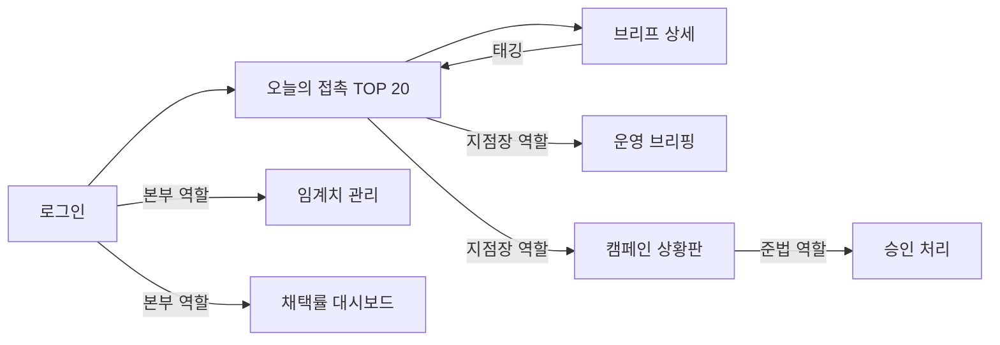

# BranchSense 와이어프레임

- **버전**: v1.1.2
- **작성일**: 2026-08-26 (최종 수정: 2026-09-08)

---

## 변경 이력

| 버전 | 날짜 | 내용 |
|---|---|---|
| v1.0.0 | 2026-08-26 | 초안 작성 |
| v1.1.0 | 2026-09-08 | NH뱅크 인터넷뱅킹 UI 참고 캡처를 반영해 공통 레이아웃에 상단 유틸리티 바 추가, 오늘의 접촉 화면에 상태 필터 탭·업종 배지 추가. 컴포넌트 매핑은 `9-style-guide.md` v1.1.0을 따른다 |
| v1.1.1 | 2026-09-08 | 문서 정합성 점검 결과 반영: 접근 권한 표기를 `본부(마케팅)`/`본부(준법)`로 명확화(`1-domain-definition.md` v1.1.1 VAL-08과 정합), 캠페인 화면의 '준법대기' 라벨이 `CAMPAIGN.status = MANAGER_REVIEW`에 대응함을 명시. 하위 문서 인용 버전 정정 |
| v1.1.2 | 2026-09-08 | 큰글 모드(표시 개인화) 기능 제외 결정에 따라 §1 상단 유틸리티 바 목업과 서술에서 "큰글" 토글을 제거 |

---

## 0. 문서 목적 및 전제

본 문서는 `4-project-principle.md`(v1.2.0) 6장에 정의된 프론트엔드 페이지(`frontend/src/pages/`)의 화면 구조를 정의한다. 시각 스타일(컬러·타이포그래피·컴포넌트 톤)은 `9-style-guide.md`에서 다루며, 본 문서는 레이아웃과 정보 배치만 다룬다.

- `2-prd.md`(v1.2.0) 6장에 따라 **데스크톱 우선**(1280px 기준)으로 설계하고, 태블릿(768~1279px)까지 대응한다. 모바일 전용 레이아웃은 이 단계에서 정의하지 않는다(영업점 창구·사무 공간에서 데스크톱/태블릿으로 사용하는 것을 전제로 한다).
- 화면 접근 권한은 역할(RM/지점장/본부(마케팅)/본부(준법))에 따라 다르다(VAL-08). 아래 각 화면에 접근 가능한 역할을 명시한다.
- Phase 2·3 전용 화면(운영 브리핑, 캠페인, 채택률 대시보드)도 함께 정의하되, 실제 구현 시점은 `7-execution-plan.md`를 따른다.
- (v1.1.0) 2026-09-08 제공된 NH뱅크 인터넷뱅킹 화면 캡처를 레이아웃 참고 자료로 반영한다: 최상단 유틸리티 바(사용자/세션/보조 링크) 분리, 상태 전환용 밑줄 탭, 카드 내 액션 버튼 가로 배치, 항목 앞 outline 배지. 스타일(색상·형태) 세부는 `9-style-guide.md` §5.7~5.8을 따른다. (v1.1.2) 참고 캡처의 "큰글" 접근성 토글은 BranchSense 요구사항(REQ/UC)에 근거가 없어 반영하지 않는다.

---

## 1. 공통 레이아웃

모든 인증 화면은 **상단 유틸리티 바 + 좌측 고정 사이드바 + 지점 헤더 + 콘텐츠 영역** 구조를 공유한다. 사이드바 메뉴는 역할에 따라 달라진다.

```
┌────────────────────────────────────────────────────────────────────┐
│ BranchSense                                   한서영 님 · 09:47 연장 · 로그아웃 │
│                                                      고객센터 · 도움말│
├───────────────┬──────────────────────────────────────────────────┤
│ BranchSense   │ [지점명: 강남중앙지점]           [한서영 · 지점장 ▾]│
├───────────────┼──────────────────────────────────────────────────┤
│ ▣ 오늘의 접촉  │                                                    │
│ □ 운영 브리핑  │                     콘텐츠 영역                     │
│ □ 캠페인       │                                                    │
│ ──────────    │                                                    │
│ □ 임계치 관리  │  (본부 역할에만 노출)                                │
│ □ 채택률 대시보드│ (본부 역할에만 노출)                               │
│               │                                                    │
└───────────────┴──────────────────────────────────────────────────┘
```

- 최상단 유틸리티 바(`9-style-guide.md` §5.8)는 화면 전환과 무관하게 항상 고정 노출된다: 좌측 로고, 우측 사용자명·세션 연장 타이머·로그아웃, 그 아래 줄에 고객센터 등 상시 보조 링크. 세션 만료 5분 전부터 타이머 텍스트가 경고색으로 바뀐다.
- 그 아래 지점 헤더 + 사이드바 + 콘텐츠 영역 구조는 기존과 동일하다.

| 역할 | 노출 메뉴 |
|---|---|
| RM | 오늘의 접촉 |
| 지점장 | 오늘의 접촉, 운영 브리핑, 캠페인 |
| 본부(마케팅) | 임계치 관리, 채택률 대시보드 |
| 본부(준법) | 캠페인(승인 대기열 포함) |

- 데이터 지연 배지(RULE-SENSE-04)가 발생한 날은 지점 헤더 아래 배너로 "일부 신호가 지연되었습니다(기준일 N일 전)"를 표시한다.

---

## 2. 로그인 화면

**접근 권한**: 전체(비인증)

```
┌──────────────────────────────────────────────┐
│                                                │
│                 BranchSense                   │
│                                                │
│   ┌────────────────────────────────────────┐  │
│   │  아이디                                  │  │
│   └────────────────────────────────────────┘  │
│   ┌────────────────────────────────────────┐  │
│   │  비밀번호                                │  │
│   └────────────────────────────────────────┘  │
│                                                │
│              [       로그인       ]            │
│                                                │
└──────────────────────────────────────────────┘
```

---

## 3. 지점 등록/수정 화면 — `BranchSetupPage` (UC-01, UC-02)

**접근 권한**: 지점장, 본부(마케팅)

```
┌───────────────┬──────────────────────────────────────────────────┐
│ (사이드바)     │  지점 정보 등록                                     │
│               ├──────────────────────────────────────────────────┤
│               │  지점코드 [____________]  지점명 [________________] │
│               │  도로명주소 [_______________________________] 🔍   │
│               │                                                    │
│               │  ┌──────────────────────┐  담당 상권 반경           │
│               │  │                      │  ○──────●───── 1.5 km   │
│               │  │      (지도 · 담당     │  0.5km          3.0km   │
│               │  │       영역 원형 표시)  │                         │
│               │  │                      │  주력 업종 [태그 다중선택] │
│               │  └──────────────────────┘  외화취급 [✓]  ATM대수[3] │
│               │                                                    │
│               │                         [ 취소 ]   [ 저장 ]         │
└───────────────┴──────────────────────────────────────────────────┘
```

- 주소 입력 후 🔍(지오코딩) 클릭 시 3초 이내 지도에 좌표가 표시된다(UC-01 인수 기준).
- 필수 항목 누락 시 해당 입력창 하단에 빨간 텍스트로 사유를 표시한다.
- 저장 시 "다음 날 07:30 배치부터 반영됩니다"라는 안내 문구를 확인 토스트에 포함한다(RULE-BRANCH-01).

---

## 4. 오늘의 접촉 TOP 20 — `DashboardPage` (UC-06)

**접근 권한**: RM, 지점장

```
┌───────────────┬──────────────────────────────────────────────────┐
│ (사이드바)     │  오늘의 접촉 (2026-08-26)      [CRM 파일 다운로드] │
│               ├──────────────────────────────────────────────────┤
│               │  ⚠ 어제 미태깅 3건 (UC-09 예외 흐름)                │
│               ├──────────────────────────────────────────────────┤
│               │  전체  미태깅  방문함  보류  부적합         20건 중 3건 미태깅│
│               │  ────                                              │
│               │  ┌────────────────────────────────────────────┐  │
│               │  │ 1 (요식업) ○○떡볶이                  점수 92 │  │
│               │  │    사유: 인근 상권 신규 개업 3건 감지 [인허가·8/25]│
│               │  │    ( 방문함 )  ( 보류 )  ( 부적합 ▾ )          │  │
│               │  └────────────────────────────────────────────┘  │
│               │  ┌────────────────────────────────────────────┐  │
│               │  │ 2 (세탁업) △△세탁소                  점수 88 │  │
│               │  │    사유: 유동인구 12% 증가 [지하철승하차·8/24]  │
│               │  │    ( 방문함 )  ( 보류 )  ( 부적합 ▾ )          │  │
│               │  └────────────────────────────────────────────┘  │
│               │  ...(최대 20건, 탐색 슬롯 항목도 동일한 카드로 표시) │
└───────────────┴──────────────────────────────────────────────────┘
```

- 상단 `전체/미태깅/방문함/보류/부적합` 탭은 밑줄 인디케이터 방식(`9-style-guide.md` §5.7)의 상태 필터다. 목록 순서(TOP 20 순위)는 바꾸지 않고 보기만 필터링한다 — 필터 자체가 배제·재정렬 로직에 관여하지 않는다.
- 카드 앞 `(요식업)` 표기는 outline 배지(`9-style-guide.md` §5.3 `.badge--outline`)로, 스코어링에 쓰인 업종 분류를 그대로 노출한다(정보용, 필터 조건 아님).
- 카드 내 `( 방문함 )( 보류 )( 부적합 ▾ )` 버튼은 pill 형태(`9-style-guide.md` §5.1)로 렌더링한다.
- 카드 클릭 시 `BriefDetailPage`(5장)로 이동한다.
- 탐색 슬롯 여부(RULE-TARGET-04)는 이 화면에 시각적으로 구분해 표시하지 않는다.
- 태깅 버튼은 카드에서 직접 클릭 가능하다(페이지 이동 없이 클릭 1회로 저장, UC-09).
- '부적합 ▾' 클릭 시 사유 4종 드롭다운이 나타난다(VAL-06).

---

## 5. 상담 브리프 상세 — `BriefDetailPage` (UC-07)

**접근 권한**: RM, 지점장

```
┌───────────────┬──────────────────────────────────────────────────┐
│ (사이드바)     │  ← 목록으로          ○○떡볶이 · 인근 상권 5분 거리 │
│               ├──────────────────────────────────────────────────┤
│               │  선정 사유                                        │
│               │  인근 상권에 신규 개업 3건이 감지되어 상권 활력이   │
│               │  높아지고 있습니다. [지방행정인허가·2026-08-25]     │
│               │                                                    │
│               │  전화 화법                                        │
│               │  "안녕하세요, ○○은행 강남중앙지점입니다. 최근      │
│               │   상권에 신규 매장이 늘고 있어 안내드리려..."       │
│               │                                                    │
│               │  방문 체크리스트                                   │
│               │  ☐ 사업자등록증 확인                               │
│               │  ☐ 현재 거래 은행 확인                             │
│               │  ☐ 카드단말기 사용 현황 확인                       │
│               │                                                    │
│               │  ( 방문함 )   ( 보류 )   ( 부적합 ▾ )              │
└───────────────┴──────────────────────────────────────────────────┘
```

- 태깅 버튼은 `DashboardPage`와 동일한 pill 버튼(`9-style-guide.md` §5.1)을 사용해 두 화면에서 시각적으로 같은 조작임을 유지한다.
- 모든 사실 문장 옆에 `[소스명·기준일]` 출처 태그가 붙는다(RULE-BRIEF-01).
- 근거 없는 문장은 이미 생성 단계에서 제거되어 이 화면에 나타나지 않는다(RULE-BRIEF-02).

---

## 6. 운영 브리핑 — `OperationsPage` (UC-11, Phase 2)

**접근 권한**: 지점장

```
┌───────────────┬──────────────────────────────────────────────────┐
│ (사이드바)     │  운영 브리핑 (2026-08-26, 추석 D-5)                │
│               ├──────────────────────────────────────────────────┤
│               │  ┌───────────────┐┌───────────────┐┌────────────┐│
│               │  │ 현금 출납 수요 ││ ATM 충전 수요  ││ 외화 재고   ││
│               │  │  ▲ 120~150%   ││  ▲ 110~130%   ││  ▲ 105~115% ││
│               │  │  근거: 명절·   ││  근거: 명절     ││ 근거: 환율   ││
│               │  │  기상특보      ││                ││ 급등        ││
│               │  └───────────────┘└───────────────┘└────────────┘│
│               │                                                    │
│               │  오늘의 안내 상품 우선순위                          │
│               │  1. 외화예금 (근거: 환율 1.2% 상승 [ECOS·8/26])    │
│               │     └ 공개 상품설명서 인용 보기 ▾                  │
│               │  2. ...                                            │
└───────────────┴──────────────────────────────────────────────────┘
```

- 수요 예측은 항상 구간(예: 120~150%)과 근거 신호를 함께 표시한다.
- 인용 근거가 없는 상품은 우선순위 목록에 나타나지 않는다.

---

## 7. 임계치·가중치 관리 — `AdminThresholdPage` (UC-15)

**접근 권한**: 본부(마케팅)

```
┌───────────────┬──────────────────────────────────────────────────┐
│ (사이드바)     │  임계치 관리                                       │
│               ├──────────────────────────────────────────────────┤
│               │  신호종류              현재 임계치      최근 수정   │
│               │  ─────────────────────────────────────────────── │
│               │  신규 개업(상권)        [ 3   ] 건/일   2026-08-01│
│               │  추정매출 변동          (제외됨 — 2-prd.md 4장)    │
│               │  환율 일변동            [ 1.0 ] %       2026-07-15│
│               │  기상특보               발효 즉시 (고정)            │
│               │                                                    │
│               │                                    [ 변경 이력 ▾ ] │
└───────────────┴──────────────────────────────────────────────────┘
```

- 값 저장 시 즉시 검증(VAL-05)하고, 변경 이력(수정 계정·일시·이전값)을 별도 패널에서 조회할 수 있다.

---

## 8. 채택률 대시보드 — `AdoptionDashboardPage` (UC-16, Phase 2)

**접근 권한**: 본부(마케팅)

```
┌───────────────┬──────────────────────────────────────────────────┐
│ (사이드바)     │  채택률 대시보드                                   │
│               ├──────────────────────────────────────────────────┤
│               │  ┌─────────────┐┌─────────────┐┌─────────────┐   │
│               │  │ 전체 채택률  ││ 전체 태깅률  ││ 미태깅 잔량  │   │
│               │  │    34%      ││    76%      ││   142건     │   │
│               │  └─────────────┘└─────────────┘└─────────────┘   │
│               │                                                    │
│               │  신호별 × 업종별 채택률 (표)                        │
│               │  ───────────────────────────────────────────────  │
│               │  신규개업 × 요식업     42%  (표본 118, 가중치 1.3) │
│               │  기상특보 × 소매업     19%  (표본 22, 표본부족)     │
│               │  ...                                              │
└───────────────┴──────────────────────────────────────────────────┘
```

- 표본 부족(n<30) 조합은 "표본부족" 배지로 구분하고 가중치가 갱신되지 않았음을 표시한다(RULE-LEARN-03).

---

## 9. 캠페인 상황판 및 검토 — `CampaignBoardPage` (UC-12~14, Phase 3)

**접근 권한**: 지점장(검토), 본부(준법)(승인), 본부(마케팅)(상황판 조회)

```
┌───────────────┬──────────────────────────────────────────────────┐
│ (사이드바)     │  캠페인 상황판                                     │
│               ├──────────────────────────────────────────────────┤
│               │  트리거: 폭염특보 3일 연속           상태: 준법대기│
│               │  ─────────────────────────────────────────────── │
│               │  초안 미리보기                                     │
│               │  "폭염이 지속되고 있습니다. ○○은행 포용금융 상담..."│
│               │  ✓ 광고성 정보 표기   ✓ 수신거부 문구                │
│               │                                                    │
│               │  [ 지점장 검토 완료 ]   [ 준법 승인 ]   [ 반려 ]    │
│               │                                                    │
│               │  진행 이력: 초안생성(8/24) → 지점장검토(8/25) →    │
│               │             준법승인 대기중                        │
└───────────────┴──────────────────────────────────────────────────┘
```

- 광고성 정보 표기·수신거부 문구 체크가 모두 되어 있지 않으면 '지점장 검토 완료' 버튼이 비활성화된다(VAL-07).
- 화면의 '준법대기'/'준법승인 대기중' 라벨은 `CAMPAIGN.status = MANAGER_REVIEW`(`1-domain-definition.md` v1.1.2, `6-erd.md` v1.1.1)에 대응한다.
- 준법 승인 버튼은 `USER.role = HQ_COMPLIANCE`(본부(준법)) 계정에게만 노출되며, 승인 시 상태가 `APPROVED`를 거쳐 즉시 '이관완료'(`HANDED_OFF`)로 바뀐다(RULE-CAMPAIGN-01). `HQ_MARKETING`(본부(마케팅)) 계정에는 이 버튼이 노출되지 않는다.

---

## 10. 화면 흐름도



---

## 11. 참고 문서

- `1-domain-definition.md` (v1.2.0): UC-01~17 인수 기준
- `2-prd.md` (v1.2.0): 2장 목표 사용자, 6장 플랫폼/UI
- `3-user-scenario.md` (v1.1.0): SC-01~08 (화면 간 이동 흐름의 근거)
- `4-project-principle.md` (v1.2.0): 6장 프론트엔드 페이지 목록
- `9-style-guide.md` (v1.1.2): 본 문서의 레이아웃 요소에 대응하는 컴포넌트 스타일(색상·형태)
- NH뱅크 인터넷뱅킹 화면 캡처 (사용자 제공, 2026-09-08): §1 상단 유틸리티 바, §4 상태 필터 탭·업종 배지의 레이아웃 참고 자료
