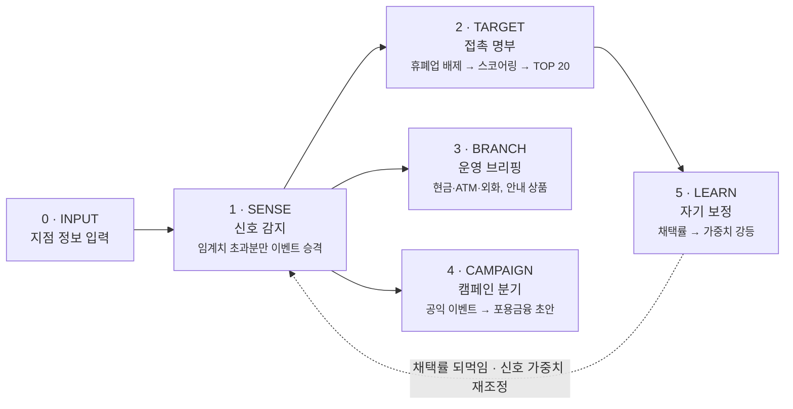

# BranchSense PRD

공개 데이터에서 매일 아침 **신호**를 감지해, 영업점이 오늘 누구를 만나야 하는지·무엇을 준비해야 하는지 근거와 함께 제시하고, 직원의 1클릭 피드백으로 스스로 정확도를 보정하는 영업점 AI 에이전트.

| | |
|---|---|
| 문서 버전 | 0.1 (초안) |
| 작성일 | 2026-08-26 |
| 상태 | 검토 대기 |
| 독자 | 기획 · 개발 · 준법 · 영업점 |

> `[확인 필요]` 표시는 착수 전 확정이 필요한 항목이다.

---

## 1. 문제 정의

영업점의 아웃바운드 영업은 지금 세 지점에서 새고 있다. 명부가 낡았고, 접촉 이유가 없고, 결과가 측정되지 않는다.

### 현재 상태

- **명부의 시차** — 접촉 명부는 과거 시점의 사업자 목록에서 출발한다. 이미 휴·폐업한 사업장에 전화가 나가면 직원의 시간과 영업점 신뢰가 함께 소모된다.
- **근거 없는 접촉** — "왜 오늘 이 사장님인가"에 답할 자료가 없다. 화법은 개인 역량에 의존하고, 신입일수록 접촉 자체를 회피한다.
- **측정 불가** — 콜 수·방문 수는 집계되지만 *추천의 품질*은 집계되지 않는다. 어떤 신호가 실제 영업으로 이어지는지 아무도 모르므로 다음 달에도 같은 방식이 반복된다.
- **운영 준비의 감각 의존** — 명절 현금 수요, 특보일 내점 감소, 환율 급변일 외화 문의 폭증은 모두 예측 가능한데 지점장의 경험에만 의존한다.

### 기회

필요한 신호는 이미 **공개 데이터로 존재**한다. 인허가·사업자상태·상권·유동인구·거시지표·기상·재난 데이터는 모두 공공 API로 열려 있고, 개인 고객정보를 한 건도 쓰지 않고 영업점 단위 판단을 만들 수 있다. 남은 문제는 신호를 *선별*하고 *행동 가능한 형태로 번역*하고 *결과를 되먹이는* 것이다.

> **핵심 가설**
> 근거가 태깅된 추천은 직원이 실제로 채택한다. 그리고 채택 여부를 1클릭으로 수집하면 신호의 가치를 사후에 계량할 수 있다 — 이것이 지금까지 존재하지 않던 데이터다.

---

## 2. 목표와 지표

북극성 지표는 콜 수가 아니라 **채택률**이다. 추천이 실제 영업 행동으로 이어진 비율을 측정 가능한 수치로 만든다.

| 구분 | 지표 | 설명 |
|---|---|---|
| North Star | 채택률 | 추천 건수 대비 '방문함' 태깅 비율 |
| 전제 지표 | 태깅률 70% | 학습 루프의 연료. 미달 시 F-5 무력화 |
| 품질 하한 | 0건 | 명부 내 휴·폐업 사업장 포함 건수 |
| 운영 SLA | 07:30 | 전 지점 브리프 생성 완료 (P95) |

### 단계별 목표

| 단계 | 목표 | 측정 방식 | 기준 |
|---|---|---|---|
| MVP | 채택률 **측정 체계** 확립 | 파일럿 지점 태깅률 | ≥ 70% |
| MVP | 오접촉 제거 | 명부 내 휴·폐업 포함률 | 0% |
| MVP | 브리프 신뢰 | 출처 태그 누락 문장 비율 | 0% |
| Ph.2 | 학습 루프 효과 입증 | MVP 베이스라인 대비 채택률 | 상대 +20% |
| Ph.2 | 운영 브리핑 유효성 | 현금·외화 예측 구간 적중률 | ≥ 80% |
| Ph.3 | 캠페인 전환 | 초안 → 실제 집행 비율 | `[본부 협의]` |

채택률의 절대 목표치는 **의도적으로 비워둔다**. 지금까지 측정된 적이 없어 베이스라인이 없기 때문이다. MVP 12주 동안 수집한 값을 베이스라인으로 확정한 뒤 Phase 2 목표를 수치화한다.

---

## 3. 사용자

| 역할 | 하루 중 접점 | 이 제품에서 얻는 것 | 이탈 신호 |
|---|---|---|---|
| 영업점 담당자 (RM·개인영업) | 출근 직후 5분, 접촉 직전 30초 | 오늘의 접촉 TOP 20, 선정 사유 한 줄, 화법·체크리스트 | 사유가 납득되지 않으면 명부 전체를 무시 |
| 지점장 | 조회 시간, 주간 회의 | 운영 브리핑(현금·ATM·외화), 지점 캠페인 현황판 | 예측이 빗나가면 다시 경험에 의존 |
| 본부 마케팅 | 주 단위 | 신호별·업종별 채택률, 캠페인 초안 파이프라인 | 태깅률이 낮으면 데이터를 신뢰하지 않음 |
| 준법감시 | 캠페인·상품 안내 발생 시 | 출처·프롬프트·모델 버전이 남은 감사 추적 | 근거 없는 문구 1건 발견 시 전체 차단 |

> **설계 원칙**
> 담당자에게 **이 시스템은 평가 도구가 아니다**. 태깅 데이터는 신호 가중치 학습에만 쓰고 개인 성과 평가에 연동하지 않는다는 원칙을 제품 UI와 사내 공지에 명시한다. 이 원칙이 깨지는 순간 태깅은 방어적으로 왜곡되고 학습 루프 전체가 무의미해진다.

---

## 4. 범위

### 포함

- 공개 데이터 기반 신호 감지 및 이벤트 승격
- 영업점 단위 접촉 명부·상담 브리프 생성
- 영업점 운영 수요 예측(현금·ATM·외화)
- 캠페인 *초안* 생성 및 현황판
- 1클릭 피드백 수집과 가중치 자동 보정
- CRM 등록용 파일 생성(CSV/XLSX)

### 제외

- 개인 고객정보·거래정보 활용 — **전 단계 미사용**
- 실제 문자·알림톡 *발송* (초안까지만, 발송은 기존 채널)
- 여신 심사·한도 판단 등 의사결정 자동화
- CRM 양방향 실시간 연동 (Phase 3에서 재검토)
- 개인 성과 평가 지표 산출

---

## 5. 시스템 개요

지점 정보 입력에서 시작해 매일 07:30 공통 엔진이 신호를 감지하고, 세 갈래 산출물(명부·운영·캠페인)로 분기한 뒤, 직원의 피드백이 다시 신호 가중치로 돌아오는 폐루프 구조.



### 구현 스택

- **수집·배치** — Python. 소스별 커넥터를 순수 함수로 분리하고, 원본 응답을 날짜 파티션 스냅샷으로 적재(재현성 확보).
- **판단** — 룰 기반 임계치 + 채택률 학습 가중치 하이브리드. 순위 산정은 결정론적 코드가, 자연어 생성만 LLM이 담당한다.
- **생성** — LLM Tool Calling. 모델은 도구로 조회한 값만 인용할 수 있고, 도구 결과에 없는 사실을 쓰면 검증 단계에서 차단된다.
- **상품 안내** — 당행 공개 상품설명서 RAG. 인용 문단 ID를 반드시 반환.
- **산출** — 웹 대시보드 + CRM 등록용 파일 다운로드.

> **아키텍처 결정**
> **순위는 LLM이 정하지 않는다.** 스코어링·배제·임계치는 전부 코드로 구현하고, LLM은 확정된 결과를 문장으로 옮기는 역할만 맡는다. 감사 추적 가능성, 재현성, 비용, 07:30 SLA를 동시에 만족시키는 유일한 배치다.

---

## 6. 기능 요구사항

각 요구사항의 **수용 기준**은 QA가 그대로 테스트 케이스로 옮길 수 있는 수준으로 기술한다.

### F-0. 지점 정보 입력 `MVP`

에이전트가 "이 지점이 어디를 담당하는가"를 인식하기 위한 최소 정보를 웹에서 등록한다. 모든 후속 단계의 공간 기준점이 된다.

**세부 요구**

- 기본 정보 — 지점코드, 지점명, 도로명주소, 위경도(주소 입력 시 지오코딩 자동 변환)
- 담당 상권 — 반경(기본 1km, 0.5~3km 조정) 또는 행정동 다중 선택. 지도에서 영역을 시각 확인하고 수정할 수 있어야 한다.
- 영업 성격 — 주력 업종 태그, 취급 상품군, 외화 취급 여부, ATM 대수, 창구 수
- 담당자 계정 — 지점 소속·권한(담당자/지점장/본부) 등록

**수용 기준**

- [ ] 주소 입력 후 3초 이내 좌표가 채워지고, 지도에 담당 영역 폴리곤이 표시된다.
- [ ] 지점 정보 저장 시 **다음 배치(익일 07:30)부터** 신호 범위에 반영된다.
- [ ] 필수 항목 누락 시 어떤 항목이 왜 필요한지 필드 옆에 표시한다.
- [ ] 동일 지점코드 중복 등록은 거부하고 기존 레코드 수정으로 안내한다.

### F-1. 신호 감지 — 매일 07:30 공통 엔진 `MVP`

3계층 소스를 수집해 전일 대비 변화를 계산하고, **임계치를 넘은 변화만** 이벤트로 승격한다. 승격되지 않은 변화는 저장하되 알리지 않는다 — 알림 과부하 방지가 이 단계의 존재 이유다.

**신호 계층**

- **사업자** — 신규 개업, 휴업·폐업, 영업정지, 업종 전환
- **상권** — 업종별 점포 증감, 유동인구 변동
- **거시·환경** — 환율·기준금리·유가·BSI, 기상특보, 재난문자, 공휴일·명절

**세부 요구**

- 임계치는 **설정 파일로 외부화**하고 본부 관리자가 UI에서 조정 가능해야 한다. 초기값 예시: 담당 상권 신규 개업 ≥ 3건/일, 담당 상권 업종별 점포 증감 전분기 대비 ±10%, 환율 일변동 ≥ 1.0%, 기상특보 발효, 재난문자 수신.
- 중복 억제 — 동일 대상·동일 신호가 쿨다운 기간(기본 14일) 내 재발하면 기존 이벤트에 병합한다.
- 지점당 일일 이벤트 상한(기본 8건). 초과분은 점수 순으로 절사하고 "외 N건"으로 표시한다.
- 소스별 **기준일(as-of date)** 을 이벤트에 함께 기록한다. 갱신 주기가 소스마다 다르므로 UI에서 반드시 노출한다.

**수용 기준**

- [ ] 전 지점 배치가 07:30까지 완료된다(P95). 초과 시 운영자에게 알림이 발송된다.
- [ ] 외부 소스 1개가 장애일 때 배치는 실패하지 않고 **전일 스냅샷으로 폴백**하며, 해당 신호에 "데이터 지연(기준일 N일 전)" 배지가 붙는다.
- [ ] 임계치 미달 변화는 이벤트 목록에 나타나지 않으나 원장에는 저장되어 사후 분석이 가능하다.
- [ ] 동일 신호 중복 알림이 쿨다운 기간 내 2회 이상 발생하지 않는다.

### F-2. 접촉 명부와 상담 브리프 `MVP`

이벤트를 영업 행동으로 번역하는 단계. 배제 → 스코어링 → 브리프 생성 순서로, 배제가 스코어링보다 **먼저** 일어난다.

**배제 필터 (스코어링 이전)**

- 휴업·폐업·영업정지 상태 사업장
- 최근 접촉 이력이 쿨다운(기본 30일) 내인 대상
- 이전에 '부적합'으로 태깅된 대상 (사유별 영구/한시 구분)
- 수신거부 등록 대상

**스코어링**

```
Score = ( Σᵢ wᵢ · sᵢ ) × 근접도(거리) × 규모적합도(업종·규모 vs 지점 주력)
```

- `wᵢ`는 F-5 학습 루프가 갱신하는 신호별 가중치, `sᵢ`는 정규화된 신호 강도(0~1).
- 상위 20건을 "오늘의 접촉 TOP 20"으로 확정하되, 그중 **3자리는 탐색 슬롯**으로 배정한다(F-5 참조).

**브리프 생성**

- 선정 사유 1줄 — 어떤 신호가 왜 이 대상을 올렸는지
- 전화 화법 3문장 이내 + 방문 체크리스트
- **모든 사실 문장에 출처 태그** — `[소스명 · 기준일]` 형식
- CRM 등록용 CSV/XLSX 다운로드 (컬럼 매핑은 `[CRM팀 확인 필요]`)

**수용 기준**

- [ ] 생성된 명부에 휴·폐업 상태 사업장이 **0건** 포함된다.
- [ ] 브리프 내 모든 사실 문장에 출처 태그가 붙는다. 도구 조회 결과에 근거가 없는 문장은 생성 단계에서 차단되고 해당 항목은 사유만 표시된다.
- [ ] 확정 수익·원금 보장 등 금칙 표현이 화법에 포함되지 않는다.
- [ ] 브리프 1건 생성 지연이 5초를 넘지 않는다.
- [ ] 다운로드 파일을 CRM에 등록할 때 수작업 편집이 필요 없다.

### F-3. 영업점 운영 브리핑 `Phase 2`

같은 신호를 **지점 운영 준비**로 번역한다. 개인 고객정보를 쓰지 않고 영업점 단위 수요로만 산출한다.

**세부 요구**

- 공휴일·명절·기상 신호 → 현금 출납·ATM 충전·외화 재고 수요 예측
- 환율·금리·유가 신호 → 당일 안내 상품 우선순위 (예: 원/달러 급등일 → 환전·외화예금 상단 배치)
- 예측은 **단일 값이 아니라 구간**으로 제시하고, 근거가 된 신호를 함께 표시한다.
- 상품 안내 문구는 당행 공개 상품설명서 RAG 인용을 필수로 하고, 인용 문단을 펼쳐볼 수 있다.

**수용 기준**

- [ ] 모든 수요 예측에 구간과 근거 신호가 함께 표시된다.
- [ ] 상품 우선순위 항목에 인용 출처가 없으면 노출되지 않는다.
- [ ] 산출 과정에 개인 고객 식별정보가 입력되지 않음을 데이터 계보로 증명할 수 있다.
- [ ] 예측 구간 적중률이 주 단위로 자동 집계되어 대시보드에 표시된다.

### F-4. 캠페인 자동 분기 `Phase 3`

재해·폭염 같은 공익 이벤트를 포용금융 안내 캠페인 초안으로 연결한다. **시스템은 발송하지 않는다** — 초안 생성과 검토 흐름까지가 범위다.

**세부 요구**

- 트리거 정의 — 재난문자 수신, 폭염·한파 특보 지속 N일, 특정 업종 집단 피해 신호
- 산출물 — 안내 문자 초안(광고성 정보 표기·수신거부 문구 포함), 게시물 초안, 대상 세그먼트 정의(영업점 단위)
- 검토 흐름 — 초안 생성 → 지점장 검토 → 본부 준법 승인 → 기존 발송 채널로 이관. 각 단계의 승인자·시각이 기록된다.
- 영업점 캠페인 상황판 — 진행 단계, 담당자, 경과일 표시

**수용 기준**

- [ ] 준법 승인 없이 발송 채널로 이관되는 경로가 시스템상 존재하지 않는다.
- [ ] 모든 문자 초안에 광고성 정보 표기와 수신거부 안내가 자동 포함된다.
- [ ] 초안·수정본·승인 이력이 전부 보존되어 사후 감사 시 재구성 가능하다.

### F-5. 채택률 기반 자기 보정 `MVP · 수집`

이 제품의 차별점. 직원의 1클릭 태깅을 에이전트가 스스로 수집해 신호별 가중치를 자동 조정한다. MVP에서는 **수집만** 하고, 충분한 표본이 쌓인 Phase 2에서 가중치 갱신을 활성화한다.

**세부 요구**

- 태깅 UI — 명부 각 항목에 **방문함 / 보류 / 부적합** 3버튼. 클릭 1회로 저장되고 되돌리기가 가능해야 한다.
- '부적합' 선택 시 사유를 한 번 더 선택(이미 거래중 / 대상 아님 / 정보 오류 / 접촉 불가). 사유는 배제 필터로 환류된다.
- 집계 — 신호별 × 업종별 채택률, 지점별 태깅률, 미태깅 잔량
- 가중치 갱신 — 상세 설계는 8장 참조

**수용 기준**

- [ ] 태깅 1건 저장에 필요한 조작이 클릭 1회다(부적합 사유 선택 제외).
- [ ] 미태깅 항목은 다음 날 명부 상단에 "어제 미태깅 N건"으로 상기된다.
- [ ] 가중치가 변경되면 변경 전후 값·근거 표본 수·적용 일시가 이력으로 남는다.
- [ ] 표본 부족(n < 30) 구간의 가중치는 갱신되지 않고 초기값을 유지한다.

---

## 7. 데이터 소스

소스마다 갱신 주기가 다르다는 사실이 이 제품의 가장 큰 설계 제약이다. "매일 감지"는 **일 단위 소스에만** 해당하며, 분기 소스는 분기 신호로 등급을 분리해야 한다. 아래 목록은 실제 Open API 존재 여부를 확인한 결과이며, **연동 불가 판정 소스는 표에서 제외**했다.

| 소스 | 제공 | 갱신 | 용도 | 유의사항 |
|---|---|---|---|---|
| 사업자등록정보 진위확인 및 상태조회 API | 국세청 (data.go.kr) | 실시간 (30분 주기 반영) | 휴·폐업 배제 검증 | 사업자번호를 **입력해야** 조회되는 방식. 전수 목록을 주지 않으므로 *신규 개업 탐지원으로는 쓸 수 없다.* 보유 명부 검증용으로 한정. 호출 한도 1회 100건 · 1일 100만건. |
| 지방행정 인허가 데이터개방 API | 행안부 (localdata.go.kr) | 일 | 신규 개업·폐업 1차 신호 | 전국 245개 지자체가 매일 취합. 195종 업종 인허가 데이터. **신규 개업 탐지의 실질적 주력원.** 인허가일과 실제 개업일 간 시차 존재. |
| 상가(상권)정보 API | 소상공인시장진흥공단 (data.go.kr) | 분기 | 업종별 점포 증감 | 전국 영업 중 상가업소 데이터(상호·업종·위치). 일 단위 신호가 아니다. 분기 델타로만 산출하고 UI에 기준 분기를 표기. |
| 지하철 승하차 인원 API | 서울 열린데이터광장 · 부산교통공사 등 | 일 (T+3~5) | 유동인구 프록시 | **서울·부산 등 도시철도 보유 지자체로 커버리지 한정.** 지방·비역세권 지점은 대체 지표 필요 — 인허가 밀도, 카드매출 통계 등. |
| ECOS Open API | 한국은행 | 일 · 월 혼재 | 환율·금리·BSI | 지표별 발표 주기가 다르다. BSI는 월 단위이므로 일간 이벤트 대상 아님. |
| 오피넷 유가정보 API | 한국석유공사 | 일 | 유가 신호 | 시도·시군별 평균가 API 제공. 지점 상권 단위로 매핑. |
| 기상특보 조회서비스 | 기상청 (data.go.kr) | 수시 | 내점·현금 수요, 캠페인 트리거 | 특보 발효/해제가 이벤트. 예보는 참고값. |
| 긴급재난문자 API | 행안부 (data.go.kr · safetydata.go.kr) | 수시 | 공익 캠페인 트리거 | 지역 코드 기반 지점 매칭. 재난안전데이터공유플랫폼 별도 가입 필요. |
| 공개 상품설명서 | 당행 내부 | 개정 시 | 상품 안내 RAG | 공공데이터 아님. **준법 검수본만** 색인. 개정 시 구버전 인용 차단 필요. |

### 연동 불가 판정 — 제외

| 소스 | 제공 | 제외 사유 |
|---|---|---|
| 우리마을가게 상권분석서비스(추정매출) | 소상공인시장진흥공단 / 서울시 | **서울시 상권으로 커버리지가 한정된 서비스**다. 전국 지점을 대상으로 하는 이 제품에 쓰면 서울 외 지점은 이 신호를 영구히 받지 못해 형평성 문제가 생긴다. 데이터셋 상당수가 2018년 이후 갱신이 끊겨 신선도도 담보되지 않는다. |

이에 따라 F-1 상권 계층의 신호는 **점포 증감·유동인구**로 한정하고, "추정매출"은 신호·임계치·미해결 이슈에서 모두 제거했다.

> **확인이 필요한 전제**
> 기획안의 "매일 07:30 상권 신호 감지"는 상가(상권)정보가 분기 갱신이라는 점과 충돌한다. 해결책은 신호를 **일간 신호(인허가·거시·기상)** 와 **분기 신호(점포 증감)** 로 등급 분리하고, 분기 신호는 갱신일에만 이벤트로 승격시키는 것이다. 이 문서는 그 전제로 작성했다.

---

## 8. 학습 루프 설계

### 채택률 정의

```
채택률 = 방문함 태깅 수 ÷ 태깅된 추천 수
태깅률 = 태깅된 추천 수 ÷ 노출된 추천 수
```

- 미태깅 항목은 분모에서 **제외**한다. 미태깅을 실패로 간주하면 바쁜 지점의 신호가 부당하게 강등된다.
- 대신 태깅률을 별도 지표로 관리한다. 태깅률이 낮은 지점의 데이터는 가중치 갱신에서 신뢰도 하향 처리한다.
- '보류'는 채택도 거부도 아니므로 분자에서 제외하되 분모에는 포함한다.

### 가중치 갱신

신호 `i` × 업종 `c` 조합마다 채택 성공/실패를 베타 분포로 누적하고, **하위 신뢰 구간**으로 평가한다. 표본이 적은 신호가 우연히 높은 채택률을 기록해 과대평가되는 것을 막기 위해서다.

```
α, β  ←  지수감쇠 누적 (반감기 30일)
p̂     =  Beta(α, β)의 5% 분위수
w     ←  clip( w₀ × p̂ / p̄ , 0.2 , 2.0 )
```

- `p̄`는 전체 평균 채택률. 평균보다 잘하면 승급, 못하면 강등된다.
- 하한 `0.2`를 두어 신호가 완전히 사라지지 않게 한다 — 계절성이나 시장 국면에 따라 부활할 수 있기 때문이다.
- 반감기 30일 감쇠로 과거 성과보다 최근 성과를 무겁게 반영한다.
- 갱신 주기는 주 1회. 매일 갱신하면 노이즈에 과반응한다.

### 선택 편향 방지

> **가장 중요한 설계 결정**
> 상위 20건만 노출하면 **노출된 신호의 성과만 관측**된다. 초기에 우연히 낮게 평가된 신호는 영원히 노출되지 않아 성과를 증명할 기회를 잃고, 학습 루프는 초기 가중치를 강화하는 자기 확신 장치가 된다.
>
> 해결: TOP 20 중 **3자리를 탐색 슬롯**으로 고정 배정하고, 표본이 부족한 신호 조합에서 톰슨 샘플링으로 추출한다. 탐색 슬롯 항목도 담당자에게는 동일하게 보이되, 내부적으로는 별도 표기해 성과를 분리 집계한다.

### 콜드 스타트

- 초기 60일은 룰 기반 초기 가중치를 고정한다. 이 기간의 채택률이 **베이스라인**이 된다.
- 신호×업종 조합의 표본이 30건 미만이면 갱신을 보류하고 상위 계층(신호 전체) 가중치를 상속한다.
- 신규 지점은 유사 상권 지점의 가중치를 초기값으로 상속한다.

---

## 9. 비기능 요구사항

| 영역 | 요구사항 | 측정 |
|---|---|---|
| 배치 성능 | 전 지점 신호 감지 + 브리프 생성이 07:30 이전 완료 | P95 · 일별 |
| 응답 | 대시보드 초기 로드 2초, 브리프 개별 생성 5초 | P95 |
| 가용성 | 영업시간(09–16시) 기준 99.5% | 월별 |
| 폴백 | 외부 소스 장애 시 전일 스냅샷으로 서비스 지속, 지연 배지 노출 | 장애 주입 테스트 |
| 재현성 | 임의 과거 일자의 추천을 원본 스냅샷으로 동일 재생산 가능 | 분기 검증 |
| 감사 추적 | 추천 1건마다 입력 신호·소스 기준일·프롬프트·모델 버전·출력을 보존 | 보존 1년 |
| 그라운딩 | 도구 조회 결과에 근거 없는 문장은 출력 차단 | 회귀 테스트셋 |
| 보안 | LLM 추론 경로 및 데이터 반출 범위 | `[보안팀 확인 필요]` |

> **조기 결정이 필요한 항목**
> 사업자 상호·주소는 개별로는 공개정보지만, **지점 담당 상권 단위로 결합된 명부**는 영업 전략 정보에 해당한다. 외부 LLM API로 이 결합 결과를 전송할 수 있는지 여부가 아키텍처를 가른다 — 행내 전용 엔드포인트 또는 온프레미스 추론이 필요하다면 배치 처리량과 SLA 산정이 전부 달라진다. 착수 전에 확정해야 한다.

---

## 10. 컴플라이언스

아래는 제품 설계 관점의 정리이며, 모든 항목은 **법무·준법감시 검토를 거쳐야** 확정된다.

| 영역 | 쟁점 | 설계상 대응 |
|---|---|---|
| 개인정보 | 개인사업자의 상호·대표자명이 개인 식별정보에 해당할 수 있음 | 공개 출처가 제공하는 범위 내로 이용을 한정하고, 이용 목적·보유 기간을 문서화 `[법무 검토]` |
| 신용정보 | 마케팅 목적의 고객정보 이용 시 별도 동의 필요 | 고객 거래정보를 **전 단계에서 사용하지 않는 설계**로 쟁점 자체를 회피 |
| 광고성 정보 | 사전 수신동의, 야간 발송 제한, 표기 의무 | 시스템은 초안까지만 생성. 발송은 동의 관리가 이미 구현된 기존 채널이 담당 |
| 금융소비자보호 | 상품 안내 문구의 불완전판매 위험 | RAG 인용 필수 + 금칙 표현 필터 + 준법 승인 없이는 이관 불가 |
| 공공데이터 | 소스별 이용 약관·재배포 조건 상이 | 소스별 라이선스 대장 관리, 외부 공유 산출물에는 출처 표기 `[확인 필요]` |

---

## 11. 릴리스 계획

| 단계 | 기간 | 범위 | 종료 조건 |
|---|---|---|---|
| MVP | 0–3개월 | F-0 지점 입력 · F-1 일간 신호(인허가·거시·기상) · F-2 명부/브리프 · F-5 태깅 수집. 파일럿 `[지점 수 확정 필요]` | 태깅률 70%, 휴폐업 포함 0건, 07:30 SLA 4주 연속 충족 |
| Phase 2 | 4–6개월 | F-3 운영 브리핑 · F-1 분기 상권 신호 · F-5 가중치 갱신 활성화 · 탐색 슬롯 가동 | 베이스라인 대비 채택률 상대 +20%, 예측 구간 적중률 80% |
| Phase 3 | 7–12개월 | F-4 캠페인 · 전행 확산 · CRM 연동 고도화 | 준법 승인 흐름 무결성 검증, 전행 롤아웃 완료 |

MVP에서 F-5를 **수집만**으로 제한한 이유: 가중치 갱신에는 최소 표본이 필요하고, 학습 루프가 검증되지 않은 상태로 순위에 개입하면 초기 신뢰를 잃는다. 태깅 습관을 먼저 정착시키는 것이 우선순위다.

---

## 12. 리스크

| 등급 | 리스크 | 영향 | 완화 |
|---|---|---|---|
| HIGH | 태깅률 저조 | 학습 루프 전체가 작동하지 않아 차별점 소멸 | 1클릭 UX, 미태깅 상기, 개인 평가 미연동 원칙 공표. 지점 KPI 반영 여부 `[협의 필요]` |
| HIGH | 선택 편향 | 초기 가중치가 고착되어 학습이 자기확신으로 변질 | 탐색 슬롯 3자리 고정, 성과 분리 집계 |
| HIGH | LLM 환각 · 불완전판매 표현 | 준법 사고 1건으로 서비스 전면 중단 | 순위는 코드가 결정, 생성은 그라운딩 검증 + 금칙어 필터 + 감사 추적 |
| MED | 데이터 주기 불일치 | "매일 감지" 기대와 분기 데이터의 괴리로 신뢰 하락 | 일간/분기 신호 등급 분리, 기준일 상시 노출 |
| MED | 유동인구 커버리지 편중 | 비수도권·비역세권 지점의 신호 품질 저하 | 지역별 대체 지표 정의, 커버리지 부족 지점에 신호 구성 다르게 적용 |
| MED | 알림 과부하 | 명부 자체를 열지 않게 됨 | 임계치 승격, 지점당 상한 8건, 중복 억제 쿨다운 |
| MED | 외부 소스 장애 | 07:30 SLA 미달 | 전일 스냅샷 폴백 + 지연 배지, 소스별 독립 실패 처리 |
| LOW | 직원의 감시 우려 | 도입 저항, 형식적 태깅 | 평가 미연동 원칙을 UI·공지에 명시, 파일럿 지점 사전 설명 |

---

## 13. 미해결 이슈

착수 전 결정이 필요한 항목. 괄호 안은 결정 주체.

1. **제품명** — 'BranchSense'는 이 문서의 임시 명칭. (기획)
2. **LLM 추론 환경** — 외부 API 사용 가능 여부. 아키텍처·비용·SLA를 좌우하는 최우선 결정. (보안 · IT)
3. **파일럿 지점 선정** — 지점 수와 상권 유형 구성. 유동인구 커버리지 검증을 위해 수도권·지방을 섞을 것을 권장. (영업 본부)
4. **CRM 연동 방식** — 파일 다운로드로 시작할지, API 연동을 MVP에 포함할지. 컬럼 매핑 스펙 필요. (CRM · 개발)
5. **태깅의 KPI 연동 여부** — 태깅률을 지점 평가에 반영하면 태깅률은 오르지만 데이터가 왜곡될 수 있다. 트레이드오프 판단 필요. (영업 본부 · 인사)
6. **채택률 목표치** — MVP 베이스라인 측정 후 확정. (기획 · 영업 본부)
